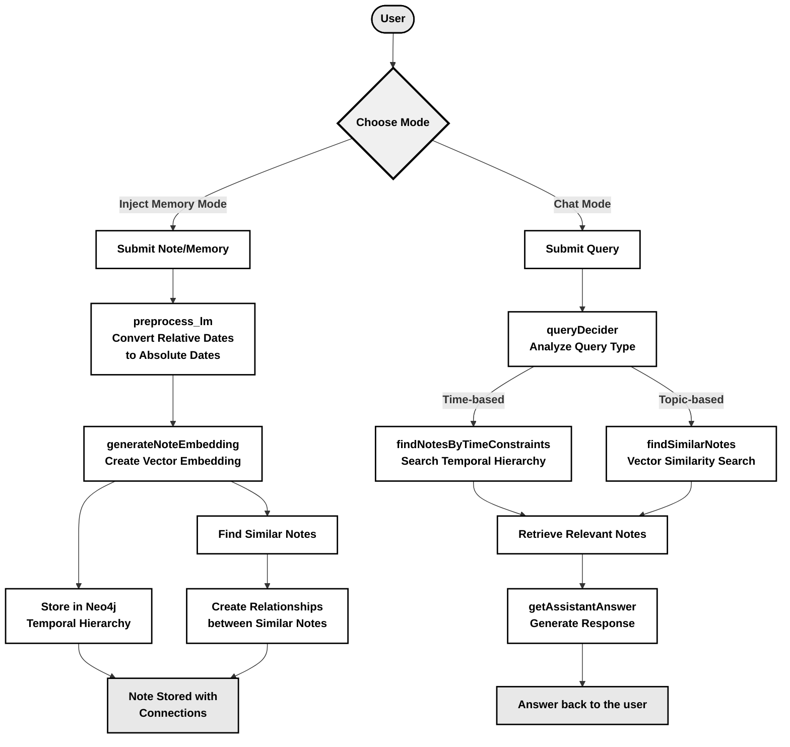

# How MindbookLM works?

MindbookLM basically has two modes of interaction: **Inject Memory Mode** and **Chat Mode**. Each mode has distinct functions that facilitate efficient note/memory management and querying.

## 1. Inject Memory Mode

### Important Functions:

- **`generateNoteEmbedding`**: This function generates embeddings for the submitted text, enabling efficient similarity searches and connections between notes. It uses sentence-transformers/all-MiniLM-L6-v2 embedding model configured in the manifest file as minilm. This model basically maps sentences & paragraphs to a 384 dimensional dense vector space which can later be used for tasks like clustering or semantic search. In modus any models or resources your app needs should be first configured in the modus.json file (the manifest file). You can use the models object in the app manifest to easily define models that your app needs.

  ```json
  "models": {
    "minilm": {
      "sourceModel": "sentence-transformers/all-MiniLM-L6-v2",
      "provider": "hugging-face",
      "connection": "hypermode"
    }
  }
  ```

  Since this model is hosted by hypermode itself, we don't need to add any additional connection.  

- **`preprocess_lm`**: This function addresses the challenge of relative date references (e.g., "yesterday" or "next Friday"). It converts these references into absolute dates while maintaining the natural flow of your writing. For example, if you write:  

  > "Yesterday I had a great meeting, and next week we'll follow up"  

  on January 8, 2025, the function will convert this to:  

  > "On January 7, 2025, I had a great meeting, and on January 15, 2025, we'll follow up."  

  This ensures the relevance and accuracy of your notes, even when reviewed at a later date.  

  This function uses a `text-generator2` model configured in the manifest file:  

  ```json
  "models": {
    "text-generator2": {
      "sourceModel": "llama-3.3-70b-versatile",
      "connection": "openai",
      "path": "chat/completions"
    }
  },
  "connections": {
    "openai": {
      "type": "http",
      "baseUrl": "https://api.groq.com/openai/v1/",
      "headers": {
        "Authorization": "Bearer {{API_KEY}}"
      }
    }
  }
  ```
  With Modus, we can use external models (not hosted by hypermode) by connecting to external endpoints. Since the above model is hosted by Groq, we add an HTTP connection to it to use the `text-generator2` in our functions.  

  Modus uses specific naming conventions for secret variables. The convention is `MODUS_<CONNECTION NAME>_<PLACEHOLDER>`. So, in this case, the API key should be configured in the `.env.dev.local` file as `MODUS_OPENAI_API_KEY`. We needed consistent and accurate performance for preprocessing, so I have used this bigger model.  

- **`addNote`**: The `addNote` function orchestrates the entire flow of Inject Mode. When a note is submitted, it is passed through the `preprocess_lm` function to handle relative dates. The system then generates embeddings for the note using `generateNoteEmbedding`. The note is stored in a temporal hierarchy in Neo4j, categorized by year, month, and day. Additionally, the system searches for similar notes using these embeddings. If similar notes are found, relationships are established between them, creating a web of interconnected memories. This mirrors human memory, enabling users to recall related experiences when reviewing a specific note.  

  This function interacts with Neo4j, so we need to configure a connection to Neo4j in the manifest.  

  ```json
  "connections": {
    "neo4j": {
      "type": "neo4j",
      "dbUri": "{{NEO4J_URI}}",
      "username": "{{USERNAME}}",
      "password": "{{PASSWORD}}"
    }
  }
  ```

  Similarly, as per the naming convention, the environment variables should be:  
  - `MODUS_NEO4J_NEO4J_URI`  
  - `MODUS_NEO4J_USERNAME`  
  - `MODUS_NEO4J_PASSWORD`  

---

## 2. Chat Mode  

### **Important Functions**  

- **`queryDecider`**  
This function analyzes the user's query and determines whether the request is time-based (e.g., "What did I do this day last month?") or topic-based (e.g., "Tell me about my coffee meetings with John").  
It also converts relative dates in the query and decides the most effective search strategy (whether to find notes based on similarity searching or temporal matching). This function uses the same Groq-hosted model configured earlier (`text-generator2`) for decision-making.  

- **`findSimilarNotes`**  
This function performs a similarity search using the vector index in Neo4j. It converts the user's query into an embedding, then finds notes with similar embeddings. The function also retrieves notes related to the similar ones, providing broader context for the query.  

- **`findNotesByTimeConstraints`**  
For time-based queries, this function searches the temporal hierarchy of notes, retrieving entries based on the time constraints identified by `queryDecider`. Both this function and `findSimilarNotes` utilize the Neo4j connection configured earlier in the manifest.  

- **`getAssistantAnswer`**  
This function takes the retrieved information and crafts a coherent, natural response to the user's query. The assistant is a `text-generator` model configured in the manifest file.  

```json
"models": {
  "text-generator": {
    "sourceModel": "meta-llama/Meta-Llama-3.1-8B-Instruct",
    "provider": "hugging-face",
    "connection": "hypermode"
  }
}
```
Since this model is hosted by Hypemode itself, we don't need to add any additional connection.

- **`querySystem`**: The `querySystem` function orchestrates the entire flow of Chat Mode. It coordinates the various functions to process the user's query and generate a meaningful response. It begins by determining the query's intent through `queryDecider`, then routes the query to either similarity-based or temporal searches. Once the relevant notes are retrieved, it passes the information to `getAssistantAnswer` to generate a final response.

# Working Flow



# How Modus is Used?

The entire backend infrastructure of MindbookLM is built using Modus. At its core, MindbookLM needed two fundamental components: AI models and a Knowledge Graph. Modus made this integration remarkably straightforward, even for someone like me who was using it for the first time.

Here's what I specifically used from the Modus ecosystem:
1. An embedding model (sentence-transformers/all-MiniLM-L6-v2) hosted on Hypermode
2. The Meta-Llama-3.1-8B-Instruct model, also on Hypermode
3. The Llama-3.3-70b-versatile model hosted on Groq, connected through Modus's HTTP connections
4. Neo4j integration for our knowledge graph

What really stood out to me about Modus (and Hypermode in general) was how they provide a complete ecosystem rather than just individual components. It's not just about AI model integration or database connections – it's about how everything works together seamlessly.

For instance, Modus automatically creates endpoints for any functions we export from our `index.ts` file, making frontend-backend communication effortless. In MindbookLM's case, since we have two modes, we simply exported two main functions: **addNote** (for inject mode) and **querySystem** (for chat mode).
Similarly, The seamless integration of AI models and the ability to easily connect to collections and graph databases like Neo4j makes development incredibly smooth. On top of all this, we can effortlessly deploy our backend application to Hypermode without any complex configuration or setup.

For a first-time user like me, having everything from model integration to automatic endpoint creation to deployment handled so seamlessly made development much more easier and efficient. 

# How Knowledge Graph is Implemented?

The knowledge graph implementation in MindbookLM came after careful consideration of how people actually write and recall their notes. I realized that while notes can be about anything, they all share one crucial element: time. Every note is inherently tied to a specific moment, and this temporal connection is vital for how we remember things.

This observation led me to organize notes in a temporal hierarchy of year->month->day. The reasoning was simple: notes taken on the same day often have some inherent connection, simply because they're part of the same day's experiences. For example, if someone writes three notes in a single day, there's a good chance they're somehow related to what was happening in their life at that moment.

But I didn't want to stop at just temporal organization. To make the MindbookLM truly useful, I needed to connect related notes regardless of when they were written. Instead of overcomplicating this, I chose to use vector embeddings and similarity scores to create these connections. It's a straightforward but effective approach.

Here's how it works in practice: When a new note comes in, two things happen:
1. It's placed within the temporal structure (either in an existing structure or a new one is created)
2. It's connected to clusters of related notes based on similarity

This dual organization turned out to be particularly powerful for answering user queries. When the user asks a very time-specific query like 'what was my day like exactly one year ago', we could find all the notes in that specific day, or if they ask 'how has been my entire January of 2025', we could collect all notes from that month, or even 'summarize my 2024' would pull all notes from that year - and pass all of these to the assistant. In these cases, similarity searching wouldn't make sense because we want every single note from those specific time periods, regardless of their content, to get a complete picture of what happened during that time. And when they ask a query that isn't time-specific and needs similarity searching, the system can pull all the notes similar to that query, and for each of those similar notes, it also retrieves their entire cluster of related notes, providing much richer context for the assistant to work with.